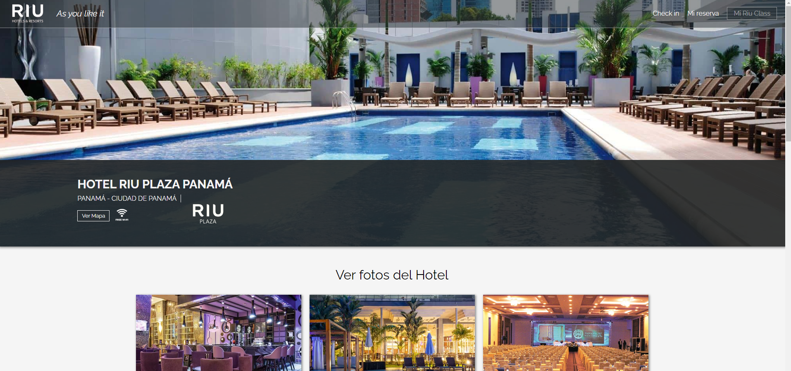
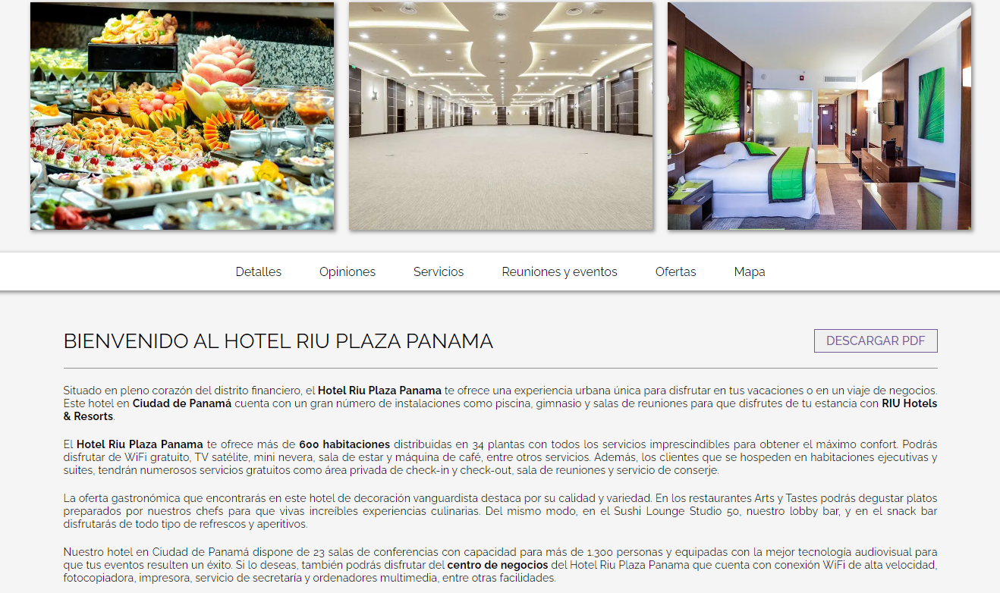

# WEB PAGE - RIU HOTELS PANAMÁ

Partial replica of the layout of the RIU Plaza Panamá Hotel website, developed with Angular.

## Deploy

https://riuhotelsplazapanama-jcbs.netlify.app/

## Pre-requisites

This project was generated with [Angular CLI](https://github.com/angular/angular-cli)

- Angular - 18.0.7
- Typescript - 5.4.2
- Node - 22.4.0

## Installation

1. Clone the repository

```bash
  git clone https://github.com/JCBalabuch/RiuHotels
```

2. Install de dependencies

```bash
  npm install
```

## Usage

Run with

```
ng serve
```

for a dev server. Navigate to `http://localhost:4200/`. The application will automatically reload if you change any of the source files.

## Features

- Responsive design
- Architecture and Best Practices:
  - Single Responsability Principle
  - Code organized in components
  - Styles crafter with SCSS

## Screenshots




## Authors

Jeniffer Balabuch

- [Github](https://github.com/JCBalabuch)
- [Linkedin](https://www.linkedin.com/in/jenifferbalabuch/)

## Feedback

If you have any feedback, please reach out to me
